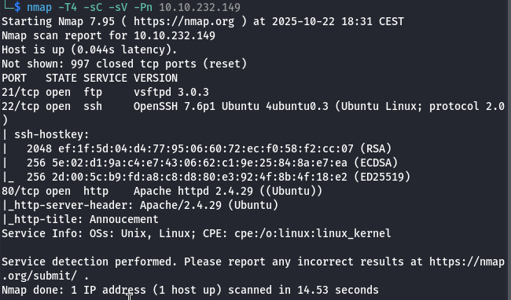

# Agent Sudo
## Zadanie

Welcome to another THM exclusive CTF room. Your task is simple, capture the flags just like the other CTF room. Have Fun!

If you are stuck inside the black hole, post on the forum or ask in the TryHackMe discord.

## Kroki

W pierwszej kolejności robimy enumerację nmap-em.

Od razu odpowiadamy na pierwsze pytanie.

*How many open ports?* **3** 

Na stronie HTTP widzimy informację że musimy użyć innego user-agent'a aby wejść na stronę co daje odpowiedz na nastepne pytanie.

*How you redirect yourself to a secret page?* **user-agent**

Postanowiłem popróbwać jednoliterowych user-agent'ów A,B,C itd. i okazało się że C przenosi nas do `/agent_C_attention.php`, tam znajdujemy odpowiedź na 3 pytanie.

*What is the agent name?* **chris**

Teraz czeka nas trochę crackowania, w pierwszej kolejności ftp, username już mamy, zapuśćmy hydrę na serwer ftp.

`hydra -l chris -P /usr/share/wordlists/rockyou.txt 10.10.232.149 ftp`

Po chwili hasło jest nasze.

*FTP password* **crystal**

Logujemy się do ftp i pobieramy pliki.

Dobrze więc loginy są ukryte w którymś ze zdjęć.

W jednym z nich jest zagnieżdżony zip który jest zaszyfrowany, spróbujmy go odszyfrować.

Używając zip2john wyciągamy hash do zdekodowania.

Udało się szybko znaleźć hasło, więc odpowiadamy na kolejne pytanie

*ZIP password* **alien**

Odczytujemy txt i znajdujemy dziwny ciag znakow, to przypomniało mi o tym że używając steghide dało się wyciągnąć informacje z pierwszego zdjęcia, niestety nie miałem hasła, spróbujmy może to będzie poprawne.

Niestety to nie jest to:

Jednak, postanowiłem zdekodować ten ciąg i okazało się że jest to słowo Area51 zakodowane w Base64, używając tego udało się otworzyć ukrytą zawartość.

*steg password* **Area51**

*Who is the other agent (in full name)?* **james**

Od razu zdobywamy hasło do SSH.

*SSH password* **hackerrules!**

Zalogujmy się jako james.

Od razu zdobywamy user flag.

*What is the user flag?* **b03d975e8c92a7c04146cfa7a5a313c7**

Mamy też zdjęcie które potrzebne jest do odpowiedzi na pytanie, pobierzmy je używając scp.

`scp james@10.10.128.133:~/Alien_autospy.jpg ~/Desktop/AgentSudo`

Aby odpowiedzieć na pytanie musimy znaleźć co znajduje sie na zdjeciu w tym celu uzywajac tineye.com przeprowadziłem reverse search.

Chodzi o nazwe 'Roswell alien autopsy' to nasza odpowiedz.

*What is the incident of the photo called?* **Roswell alien autopsy**

Po sprawdzeniu sudo -l, mamy ciekawe uprawnienie, pozwala nam ono na wykorzystanie CVE-2019-14287

*CVE number for the escalation* **CVE-2019-14287**

Cały exploit to jedna linijka terminala: https://www.exploit-db.com/exploits/47502

Tym sposobem znajdujemy ostatnią flagę.

*What is the root flag?* **b53a02f55b57d4439e3341834d70c062**

*(Bonus) Who is Agent R?* **DesKel**

## Flaga

Flaga: ****