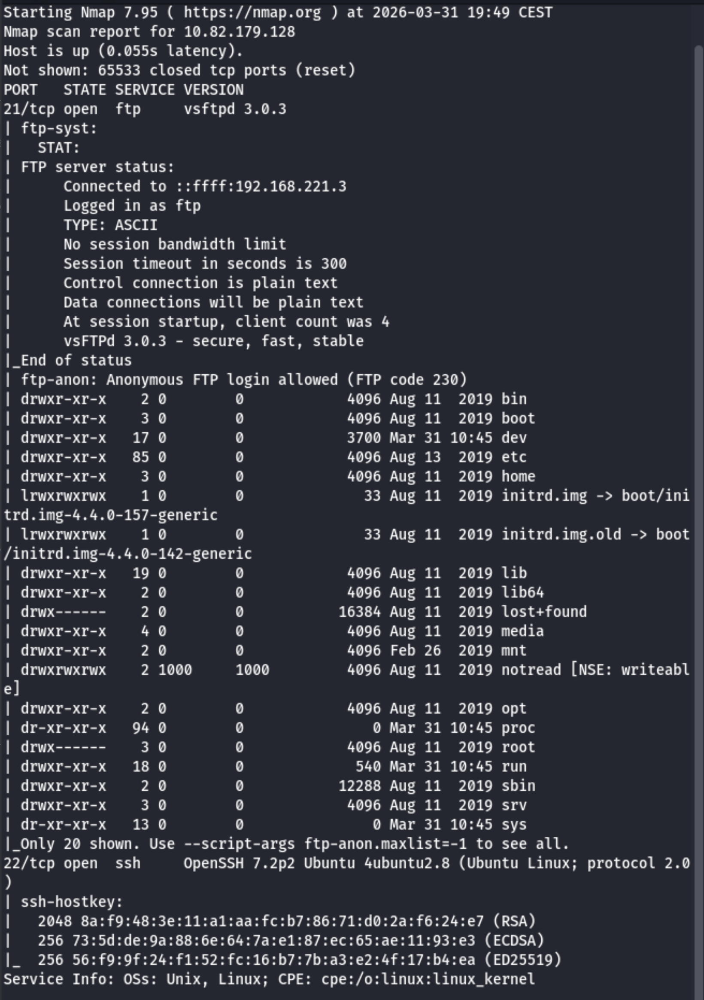
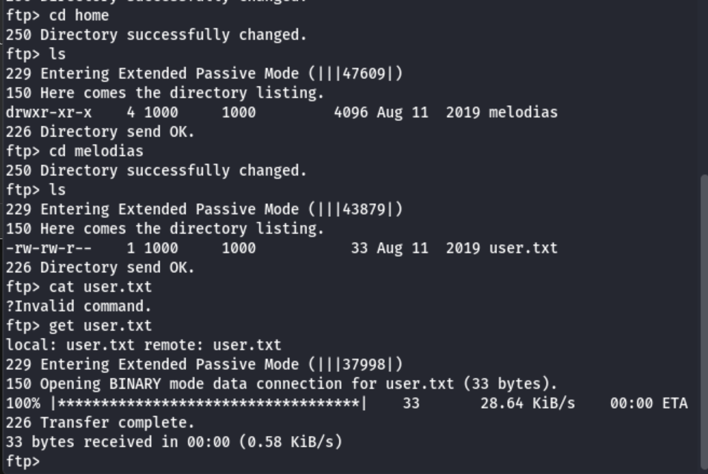
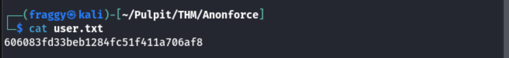
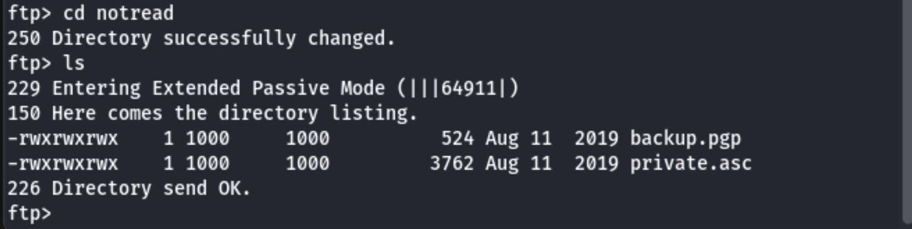
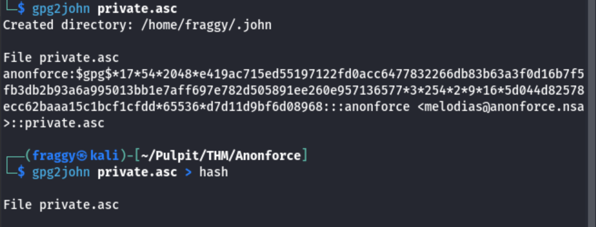
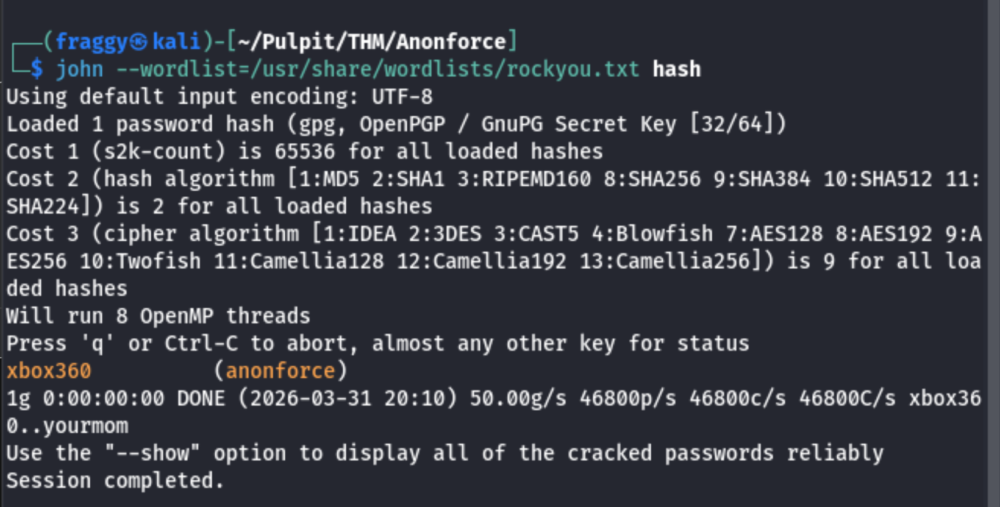
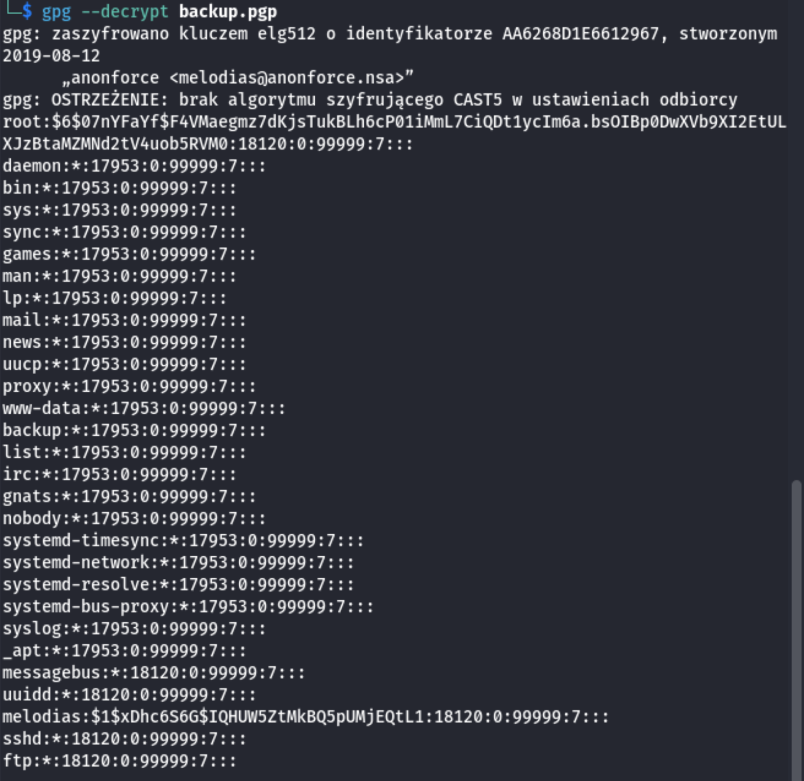
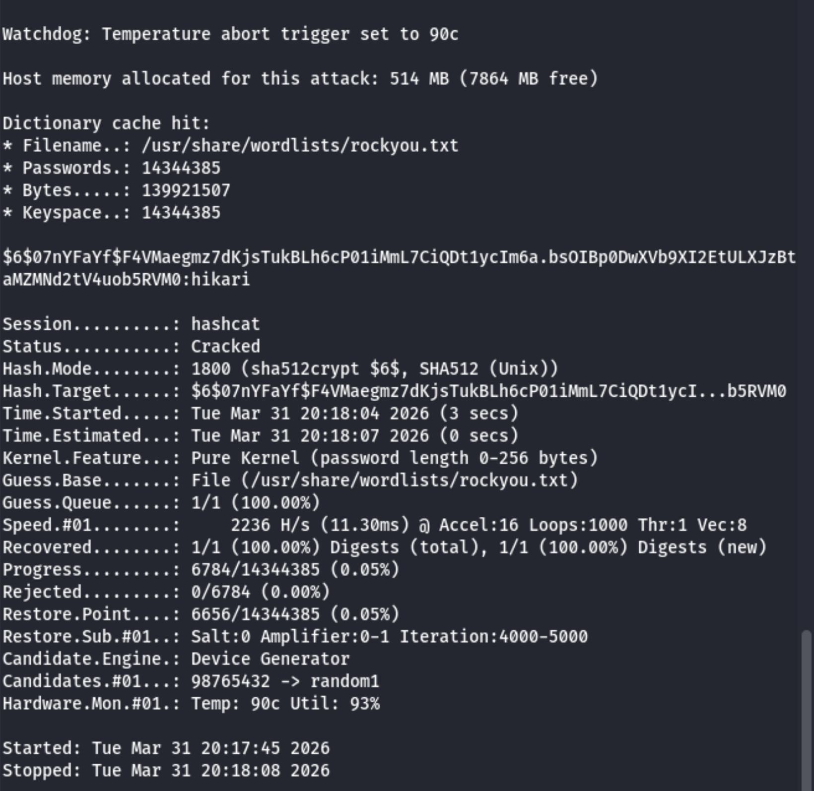
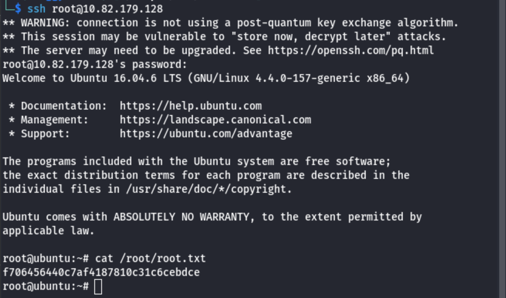

# Anonforce
## Zadanie

boot2root machine for FIT and bsides guatemala CTF

## Kroki

Standardowo zaczynamy od enumeracji usług dostępnych na hoście:

Ku zdziwieniu nie ma serwera HTTP jedynymi działającymi usługami są FTP i SSH. Dodatkowo FTP zezwala na anonymous login (może stąd nazwa zadania :) )

NSE od razu wyłapało zawartość... i wygląda na to, że FTP jest zakotwiczone w ścieżce /- interesujące. 

Okazało się że ftp pozwala na wejście do katalogu /home/melodias w którym znalazła się pierwsza flaga - user.txt.

Czas na dobranie się do flagi roota. W katalogu /notread znalazłem dwa pliki: backup.pgp oraz private.asc, pobrałem je i wziąłem się za odszyfrowanie.

Klucz prywatny jest zabezpieczony hasłem, mamy dwie drogi użycie Johna, lub znalezienie hasła w plikach. Prostsza okazała się pierwsza ścieżka.

Na początku należy używając gpg2john, przygotować nasz klucz prywatny do postaci czytelnej dla JTR. Następnie można uruchomić proces crackowania.

Jak widać całość trwała ułamek sekundy. Mamy więc hasło możemy odszyfrować backup.

Oczywiście najpierw należy zaimportować klucz używając komendy:

`gpg --import private.asc`

Po tym deszyfrujemy zgodnie z komendą na zdjęciu. Jak się okazuję naszym backupem był plik /etc/shadow, przez co możemy spróbować scrackować hasło roota.

Tym razem dla ćwiczenia posłużymy się hashcatem zgodnie z zakładką example_hashes w dokumentacji hashcata, dla unixowych haseł odpowiednim trybem jest 1800.

`hashcat -m 1800 -a 0 hash /usr/share/wordlists/rockyou.txt`

Tutaj również nie musieliśmy długo czekać, złamanie hasła zajęło 3 sekundy.

Teraz już z górki logujemy się jako root przez SSH i odbieramy ostatnią flagę!

`ssh root@<TARGET_IP>`

## Flaga

user.txt: **606083fd33beb1284fc51f411a706af8**
root.txt: **f706456440c7af4187810c31c6cebdce**