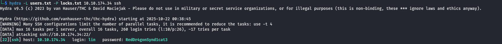

# Bounty Hacker
## Zadanie

You were boasting on and on about your elite hacker skills in the bar and a few Bounty Hunters decided they'd take you up on claims! Prove your status is more than just a few glasses at the bar. I sense bell peppers & beef in your future! 

## Kroki

Na początku standardowo zróbmy nmap scan i poznajmy otwarte porty.

Mamy 3 otwarte porty 21 22 i 80. Przyjrzyjmy się stronie HTTP. 

Jest to zwykła statyczna strona HTTP bez podejrzanej zawartości w kodzie źródłowym. Zróbmy szybką enumerację małą listą.

Niestety nic relewantnego nie udało się znaleźć.

Spróbujmy zalogować się do ftp, używamy `ftp <TARGET_IP>` i jako nazwę wprowadzamy ftp. Bingo udało nam się zalogować, teraz możemy odpowiedzieć na pierwsze pytanie. Wpisujemy `get task.txt` i wyświetlamy zawartość na naszej maszynie.

Dodatkowo uzyskaliśmy wordlistę haseł locks.txt, możemy jej użyć do zalogowania się do SSH.

*Who wrote the task list?* **lin**

*What service can you bruteforce with the text file found?* **SSH**

Nie byłem pewny który login będzie odpowiedni dla SSH, więc stworzyłem listę możliwych.

Następnie użyłem komendy:

`hydra -L users.txt -P locks.txt 10.10.174.34 ssh`

Znaleźliśmy hasło dla użytkownika lin:

*What is the users password?* **RedDr4gonSynd1cat3**

Logujemy się do SSH i odczytujemy pierwszą flagę.

*user.txt* **THM{CR1M3_SyNd1C4T3}**

Sprawdzamy sudo -l, i okazuje się że możemy uruchamiać /bin/tar na wyższych przywilejach, sprawdźmy co możemy z tym zrobić na GTFOBins.

Używając powyższego payload'u zdobywamy root'a!

Odczytujemy flagę i kolejny pokój za nami :)

*root.txt* **THM{80UN7Y_h4cK3r}**