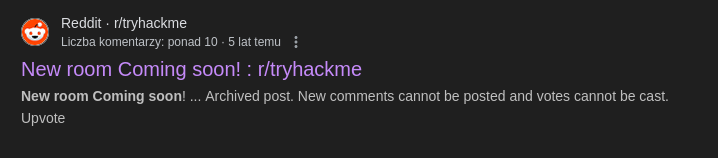

# CTF collection Vol.1
## Zadanie

Sharpening up your CTF skill with the collection. The first volume is designed for beginner.

## Kroki

Zadanie 1.

*Can you decode the following?*

*VEhNe2p1NTdfZDNjMGQzXzdoM19iNDUzfQ==*

Przy pomocy CyberChef dekodujemy base64 i otrzymujemy pierwszą flagę.

Zadanie 2.

*Meta! meta! meta! meta...................................*

Tutaj metadane używając exiftoola wyciągamy je i przy Owner Name mamy flagę:

Zadanie 3.

*Something is hiding. That's all you need to know.*

Pobieramy zdjęcie następnie używając `steghide --extract -sf img2.jpg` wyciągamy plik *Final_message.txt*, w którym znajduję się nasza flaga. Przy *Enter passphrase:* wciskamy enter.

Zadanie 4.

Wystarczy zaznaczyć treść polecenia ;)

Zadanie 5.

Pobieramy plik, znajduje się na nim kod QR, skanujemy go np. używając CyberChef, i otrzymujemy flagę!

Zadanie 6.

*Reverse it or read it? Both works, it's all up to you.*

Tutaj możemy zrobić albo reverse engineering albo po prostu użyć strings, więc użyjmy `strings -n 5 hello.hello` i nasza flaga będzie wśród wyświetlonych ciągów. (`-n 5` oznacza minimalną długość szukanego wyrazu)

Zadanie 7.

*Can you decode it?*

Podany ciąg `3agrSy1CewF9v8ukcSkPSYm3oKUoByUpKG4L` dekodujemy przy pomocy Base58 i otrzymujemy flagę!

Zadanie 8.

*Left, right, left, right... Rot 13 is too mainstream. Solve this*

Rot 13 tak, ale Rot 7 już nie, używamy szyfru Cezara z kluczem 7 i otrzymujemy naszą flagę!

Zadanie 9.

*Make a Comment. No downloadable file, no ciphered or encoded text. Huh .......*

Sugerując się podpowiedzią z polecenia używamy *Zbadaj element* i nasza flaga znajduję się w DOM z atrybutem `display: none`.

Zadanie 10.

*I accidentally messed up with this PNG file. Can you help me fix it? Thanks, ^^*

W tym przypadku mamy zmieniony nagłówek pliku, aby to naprawić otwieramy nasz plik na stronie hexed.it, tam widzimy że pierwsze 4 bajty naszego pliku to `23 33 44 5F` zgodnie z dokumentacją zmieniamy je na `89 50 4E 47`, nastepnie pobieramy zmieniony plik i odczytujemy naszą flagę.

Przed:

Po:

Zadanie 11.

`Some hidden flag inside Tryhackme social account.`

Tutaj byłem zmuszony użyć podpowiedzi gdyż przeglądająć Twittera, FB etc. nic nie znalazłem. Podpowiedź brzmiała reddit. Użyłem więc Google Dorkingu, `site:'reddit.com' & intext:'THM{'`.

Odpowiedź była w poście wyszukanym jako pierwszy!

Zadanie 12.

Mamy do odszyfrowania następujący ciąg 

`++++++++++[>+>+++>+++++++>++++++++++<<<<-]>>>++++++++++++++.------------.+++++.>+++++++++++++++++++++++.<<++++++++++++++++++.>>-------------------.---------.++++++++++++++.++++++++++++.<++++++++++++++++++.+++++++++.<+++.+.>----.>++++.`

Jest to oczywiście język Brainfuck, w identyfikacji może wam pomóc dcode.fr/cipher-identifier.

Odszyfrujmy go używając Brainfuck interpretera:

Zadanie 13.

`Exclusive strings for everyone!`

S1: 44585d6b2368737c65252166234f20626d
S2: 1010101010101010101010101010101010

Exclusive wskazuje na wykonanie operacji XOR (Exclusive OR) jest to operacja logiczna, która zwraca 1 jeśli argumenty się różnią a 0 jeśli są takie same. Dla przykładu 1 XOR 1 = 0, 0 XOR 1 = 1.

Używając pierwszego kalkulatora XOR obliczamy:

Zadanie 14.

*Binary walk. Please exfiltrate my file :)*

Binary walk podpowiada nam aby użyć narzędzia `binwalk` pozwala ono na ekstrakcję ukrytych plików. Pobieramy więc plik i używamy komendy `binwalk --dd=.* img3.jpg`.

Znaleźliśmy ZIPa, przechodzimy do katalogu który binwalk nam utworzył i odpakowujemy archiwum, w którym znajduje się nasza flaga.

Zadanie 15.

Pobieramy zdjęcie, które okazuje się być całe czarne, jednak gdy użyjemy opcji LSB Half na StegOnline to jesteśmy w stanie odczytać flagę :)

Zadanie 16.

Po pobraniu zdjęcia okazuje się ono być kodem QR, skanujemy ten kod i przenosi nas na SoundCloud, gdzie uważnie odsłuchujemy naszą flagę.

Zadanie 17.

*Sometimes we need a 'machine' to dig the past*

Targetted website: https://www.embeddedhacker.com/*
Targetted time: 2 January 2020

Chodzi oczywiście o Wayback Machine, przechodzimy i szukamy snapshota z podanej daty na podanej stronie. Gdy to zrobimy flaga będzie widoczna pod napisem THM Flag na dole.

Zadanie 18.

*Can you solve the following? By the way, I lost the key. Sorry >.<*

MYKAHODTQ{RVG_YVGGK_FAL_WXF}

Flag format: TRYHACKME{FLAG IN ALL CAP}

Cezar już był więc tutaj zapewne będzie Vigenere, użyjmy prostego Solvera.

Zadanie 19.

*Decode the following text.*

581695969015253365094191591547859387620042736036246486373595515576333693

Na początku konwertujemy tę liczbę do HEX:

Następnie kopiujemy wartość HEX i używając From Hex odczytujemy flagę:

Zadanie 20.

*I just hacked my neighbor's WiFi and try to capture some packet. He must be up to no good. Help me find it.*

Pobieramy plik pcapng i otwieramy wiresharkiem.

Filtrujemy protokoły po HTTP i otwieramy Response gdzie znajdziemy naszą flagę.

## Flagi

1. **THM{ju57_d3c0d3_7h3_b453}**
2. **THM{3x1f_0r_3x17}**
3. **THM{500n3r_0r_l473r_17_15_0ur_7urn}**
4. **THM{wh173_fl46}**
5. **THM{qr_m4k3_l1f3_345y}**
6. **THM{345y_f1nd_345y_60}**
7. **THM{17_h45_l3553r_l3773r5}**
8. **THM{hail_the_caesar}**
9. **THM{4lw4y5_ch3ck_7h3_c0m3mn7}**
10. **THM{y35_w3_c4n}**
11. **THM{50c14l_4cc0un7_15_p4r7_0f_051n7}**
12. **THM{0h_my_h34d}**
13. **THM{3xclu51v3_0r}**
14. **THM{y0u_w4lk_m3_0u7}**
15. **THM{7h3r3_15_h0p3_1n_7h3_d4rkn355}**
16. **THM{SOUNDINGQR}**
17. **THM{ch3ck_th3_h4ckb4ck}**
18. **TRYHACKME{YOU_FOUND_THE_KEY}** 
19. **THM{17_ju57_4n_0rd1n4ry_b4535}**
20. **THM{d0_n07_574lk_m3}**