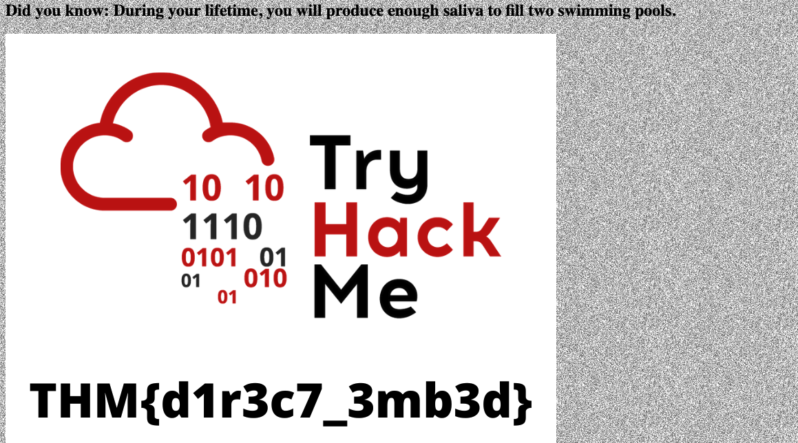
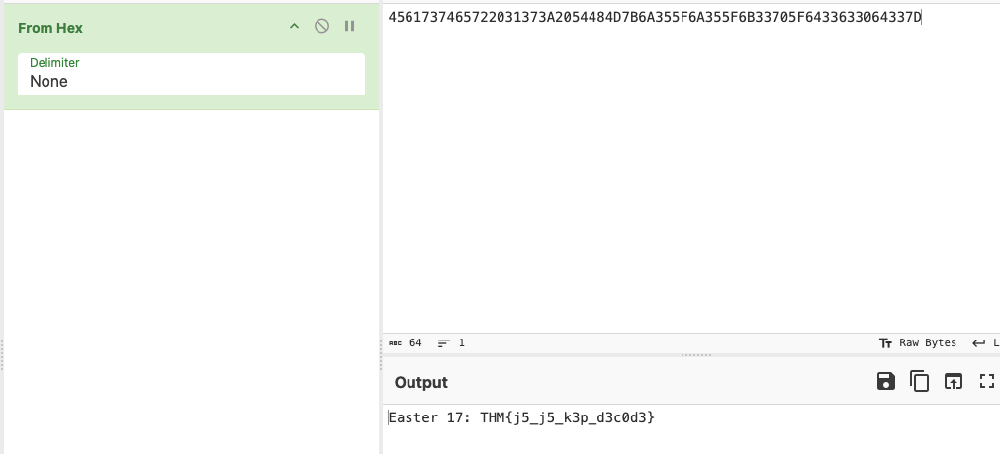

# CTF Collection Vol.2
## Zadanie

Welcome, welcome and welcome to another CTF collection. This is the second installment of the CTF collection series. For your information, the second serious focuses on the web-based challenge. There are a total of 20 easter eggs a.k.a flags can be found within the box. Let see how good is your CTF skill.

Now, deploy the machine and collect the eggs!

Warning: The challenge contains seizure images and background. If you feeling uncomfortable, try removing the background on style tag.

Note: All the challenges flag are formatted as THM{flag}, unless stated otherwise

## Kroki

Mamy stronę internetową z wieloma easter eggami, znajdzmy je wszystkie!

#1

Seems like user-agent manipulation, let's do it! 

*Easter 1*

Wchodzimy na `/robots.txt`, znajdujemy na końcu ciąg dwucyfrowych liczb szesnastkowych, wklejamy go w cyberchef'a i używamy From Hex, pierwsza flaga jest nasza!

*Easter 2*

Na `/robots.txt` mamy też scieżke w polu Disallow w base64, trik polega na tym że tekst ten jest czterokrotnie zakodowany base64. W tym celu czterokrotnie go dekodujemy i otrzymujemy ścieżkę 'DesKel_secret_base'.

Po przejściu na znalezioną podstronę, pod zdjęciem znajdziemy flagę zapisaną białym kolorem.

*Easter 3*

Wchodzimy na `/login`, otwieramy source code, tam znajdziemy pole hidden, gdy je rozwiniemy ukaże nam się flaga.

*Easter 4*

Strona `/login/` ma jeszcze jedną podatność, jest odkryta na atak SQL injection time-based, po przeprowadzeniu testów używając sqlmap, komendą która dała mi odpowiedź było: 

`sqlmap -u "http://10.10.143.77/login/" --data="password=pass&username=user" -D THM_f0und_m3 -T nothing_inside -C Easter_4 --dump`

*Easter 5*

Znów wykorzystujemy tę samą podatność, tym razem przeglądamy tabelę users, używamy do tego poniższej komendy:
`sqlmap -u "http://10.10.143.77/login/" --data="password=pass&username=user" -D THM_f0und_m3 -T user -C username,password --dump`

W rezultacie otrzymujemy w wyniku hash, który dekodujemy używając crackstation.net

Następnie logujemy się na `/login/` używając DesKel jako username, i odczytanego hasła jako password, w rezultacie otrzymujemy flagę!

*Easter 6*

Na stronie używając Burp Suite musimy kliknąc pod polem jednokrotnego wyboru i w odpowiedzi bedzie szósta flaga :)

*Easter 7*

Gdy podejrzymy sobie cookies wysyłane przez nas do strony widzimy że zawierają jeden parametr `invited` ustawiony na 0.

Gdy zmienimy tę wartośc na 1 i wyślemy zapytanie ponownie to otrzymamy flagę nr. 7 :)

*Easter 8*

W tym zadaniu musimy zmienić user-agent na "Mozilla/5.0 (iPhone; CPU iPhone OS 13_1_2 like Mac OS X) AppleWebKit/605.1.15 (KHTML, like Gecko) Version/13.0.1 Mobile/15E148 Safari/604.1", żeby strona myślała że logujemy się z konkretnego iPhone z konkretną wersją. Po tym wysyłamy request ze spreparowanym user-agent i otrzymujemy flagę.

*Easter 9*

Kiedy w Burp Suite przejdziemy do `/ready/` to widzimy, że zanim pokaże się Easter 13, to pokazuje się Easter 9:

*Easter 10*

Klikając w baner o darmowej subskrypcji przenosi na do `/free_sub/`.

Aby spełnić powyższy warunek musimy dodać nagłówek `Referer: tryhackme.com` i powtórzyć request w Burp Suite.

*Easter 11*

Musimy znaleźć single selecta "select dinner" i wysłać request podmieniając nasz wybór na "egg", w rezultacie otrzymamy flagę!

*Easter 12*

W sources znajdziemy plik jquery-9.1.2.js, który podszywa się pod plik biblioteki jquery, zawiera ją funkcję `ahem()`, która wyświetla dwunastą flagę w konsoli.

*Easter 13*

Klikamy przycisk:

Kolejna flaga jest nasza!

*Easter 14*

Przeglądając kod źródłowy znalazłem w komentarzu HTML-owy odnośnik do zdjęcia zakodowanego w base64, usuńmy go z komentarza aby wyświetlić zdjęcie!

Flaga ukaże się niżej.

*Easter 15*

Na stronie głównej znajdziemy odnośnik o tytule **Game 1**, który przenosi nas do `/game1`, przechodzimy tam i jest tam prosta gra ze wskazówką, gra koduje wprowadzone znaki według określonego klucza, musimy więc poznać to kodowanie i wpisać odkodowaną wskazówkę.

Po wprowadzeniu 'ABCDEFGHIJKLMNOPQRSTUVWXYZabcdefghijklmnopqrstuvwxyz' otrzymujemy pełen klucz ponieważ pole przyjmuje TYLKO litery.

Po zmapowaniu okazuje się że w hint mamy zakodowane słowo 'GameOver', wpisujemy je i flaga jest nasza!

*Easter 16*

Mamy również odnośnik **Game 2**, po kliknięciu analogicznie przenosi nas do `/game2`, gra wymaga od nas kliknięcia 3 przycisków jednocześnie, początkowo próbowałem napisać skrypt JS pobierający przyciski po nazwach i klikający je niestety to nie pomogło.

Po sprawdzeniu request w Burp Suite, okazuje się, że kliknięcie powoduje przekazanie w requeście informacji który przycisk kliknęliśmy.

Spróbujmy przekonać stronę że kliknęliśmy wszystkie 3 na raz i prześlijmy w parametrach informację o trzech przyciskach.

Podziałało!

*Easter 17*

Znajdujemy przycisk 'Malfunction button', początkowo wywołuje on funkcję nyan(), która nie istnieje. Pod spodem jednak w polu script, mamy funkcje catz(), która wyświetla nam pod spodem ciąg binarny.

Ten ciąg kopiujemy i przeliczamy na system 16-stkowy, następnie otrzymany wynik tłumaczymy z hex na ASCII i flaga jest nasza!

*Easter 18*

Musimy wysłać zmodyfikowany request z nagłówkiem `egg: YES`, to wyświetli naszą flagę w odpowiedzi!

*Easter 19*

Trochę niżej widzimy w kodzie HTML, dziwnie cienki obraz:

Zmieniamy jego height na wyższą wartość i otrzymujemy flagę nr. 19 :)

*Easter 20*

Na stronie mamy taki napis, spróbujmy przesłać POST request z ustawionymi podanymi parametrami!

Ostatnia flaga jest nasza!

## Flaga

Flaga: ****