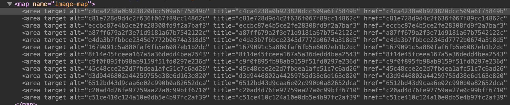
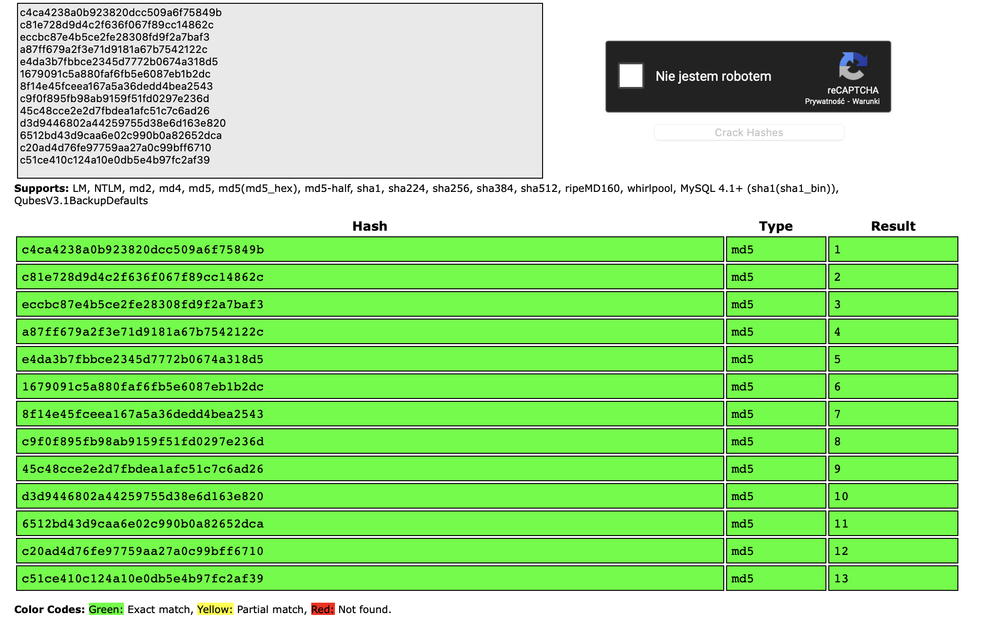

# Corridor
## Zadanie

You have found yourself in a strange corridor. Can you find your way back to where you came?

In this challenge, you will explore potential IDOR vulnerabilities. Examine the URL endpoints you access as you navigate the website and note the hexadecimal values you find (they look an awful lot like a hash, don't they?). This could help you uncover website locations you were not expected to access.

## Kroki

Strona otwiera się na zdjęciu korytarza z 13 drzwiami gdzie na każdym z nich znajduję się odnośnik do innej podstrony.

Gdy podejrzymy sobie źródło strony to widzimy, że podstrony są zapisane jako hash'e MD5.

Skopiowałem każdy z nich do decryptora na crackstation.net, i okazało się że drzwi są ponumerowane od 1 do 13.

Skoro z zadania wiemy, że mamy tu potencjalne IDOR to spróbujmy sprawdzić skrajne wartości czyli 0 i 14, oczywiście najpierw musimy obliczyć z nich skróty MD5, otrzymujemy wtedy dwie wartości:
`cfcd208495d565ef66e7dff9f98764da`
`aab3238922bcc25a6f606eb525ffdc56`

Gdy przejdziemy do pierwszego linku (/cfcd208495d565ef66e7dff9f98764da) ukazuje nam się flaga :)
## Flaga

Flaga: **flag{2477ef02448ad9156661ac40a6b8862e}**