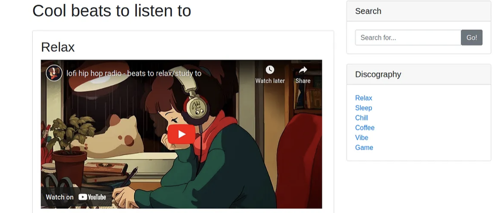

# Lo-Fi
## Zadanie

Want to hear some lo-fi beats, to relax or study to? We've got you covered!

## Kroki

Z podpowiedzi wiemy, ze mamy tu do czynienia z LFI (Local File Inclusion).

Po wejściu na stronę naszego celu widzimy prosty search bar i kilka linków przenoszących nas na inne podstrony. 

Po kliknięciu na jeden z nich np. Relax nasz link będzie wyglądać tak:
`/?page=relax.php`

I w tym miejscu umieścimy nasz payload, wazną podpowiedzią jest 

Więc nie chodzi o folder root tylko o ściezkę /
Szukamy więc ściezki w postaci ../flag.txt, po kilku próbach ściezka `/?page=../../../flag.txt` przenosi nas do flagi!
## Flaga

Flaga: **flag{e4478e0eab69bd642b8238765dcb7d18}**