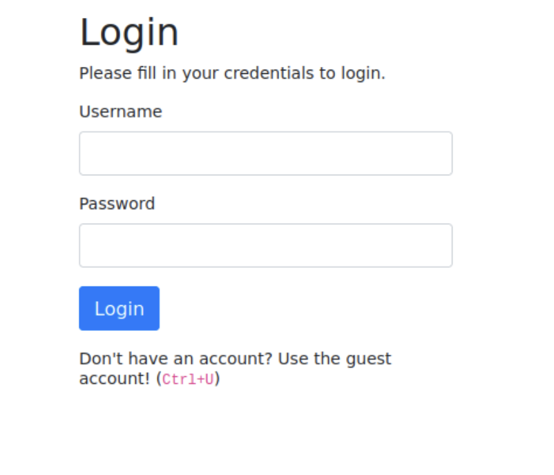
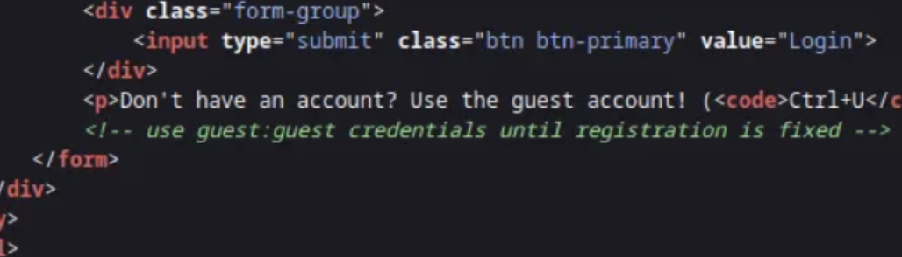

# Neighbour
## Zadanie

Check out our new cloud service, Authentication Anywhere -- log in from anywhere you would like! Users can enter their username and password, for a totally secure login process! You definitely wouldn't be able to find any secrets that other people have in their profile, right?

## Kroki

W tym zadaniu wykorzystamy podatność IDOR (Insecure Data Object Reference). Przejdźmy do samej strony.

Po wejściu na target widzimy informację aby uzyć **Ctrl + U** w celu zalogowania się jako guest.

Po uzyciu skrótu przenosi nas do `view-source`.

Na dole w komentarzu mamy w plaintext dane do logowania guest:guest. Zalogujmy się przy ich użyciu.
Po zalogowaniu się przenosi na nas do `/profile.php?user=guest`, tutaj jest nasze IDOR, zamiast guest wpisujemy admin i przenosi nas do strony z flagą!

## Flaga

Flaga: **flag{66be95c478473d91a5358f2440c7af1f}**