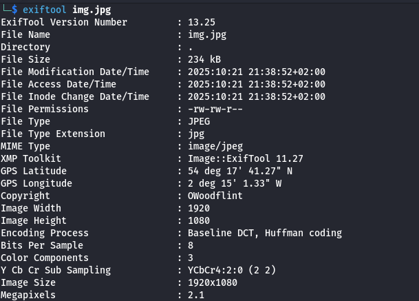
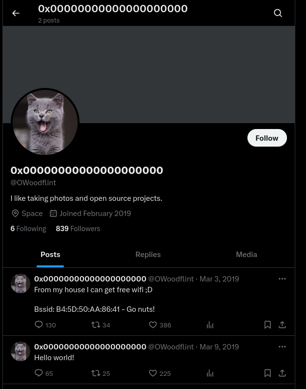
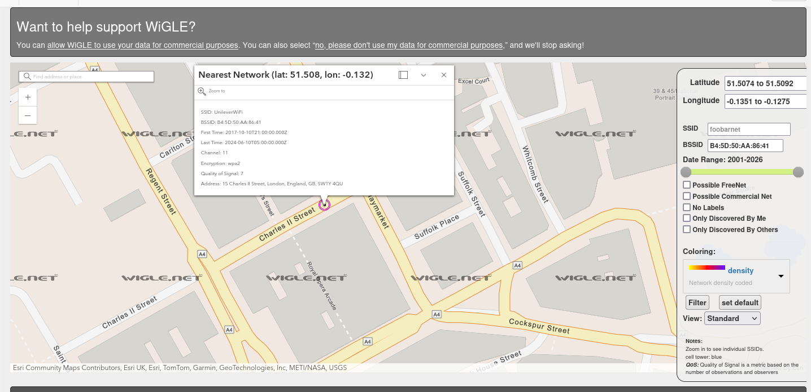
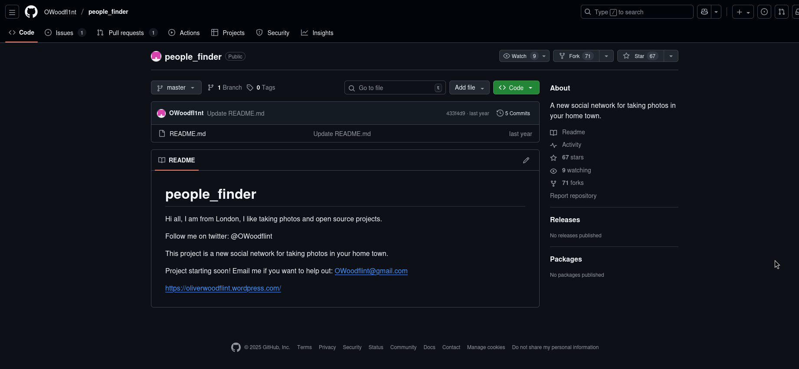
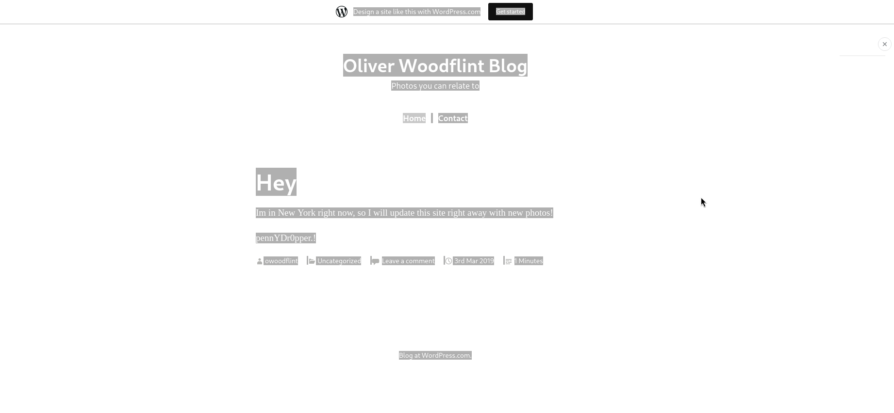

# OhSINT
## Zadanie

What information can you possible get with just one image file?

## Kroki

Mamy jedno zdjęcie z którego musimy wyciągnąć jak najwięcej informacji używając technik OSINT-u.

Jako pierwsze użyłem exiftoola aby poznać trochę więcej informacji, udało się znaleźć nazwe autora.

OWoodflint, taką frazę wpisałem w wyszukiwarkę i znalazłem m.in. profil na x.com, który odpowiada nam na trzy pytania.

*What is this user's avatar of?* **cat**

Następnie widzimy w poście że użytkownik chętnie dzieli się z nami BSSID swojej sieci, używając wigle.net możemy wyszukać na tej podstawie informacje o tej sieci, co odpowiada nam na pytanie o SSID i miasto, w którym znajduje się użytkownik.

*What is the SSID of the WAP he connected to?* **UnileverWiFi**

*What city is this person in?* **London**

Następnie znajdujemy jego profil na GitHubie co daje nam odpowiedzi na dwa pytania.

Jest tam jego e-mail.

*What is his personal email address?* **OWoodflint@gmail.com**

*What site did you find his email address on?* **GitHub**

Przechodzimy na jego stronę na WP z linku w README.md i odczytujemy że przebywa na wakacjach w Nowym Jorku.

*Where has he gone on holiday?* **New York**

Ostatnia flaga okazała się bardzo łatwa, naciśnięcie CTRL + A na stronie wordpressowej ukazuje nam hasło użytkownika jako zapisane na biało.

*What is the person's password?* **pennYDr0pper.!**
