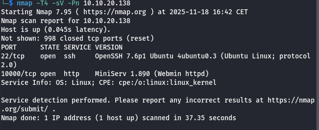
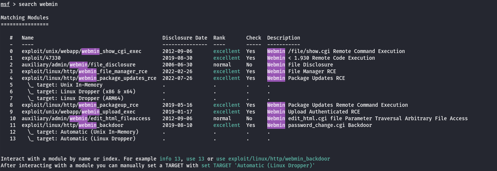
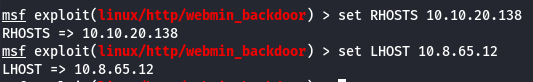
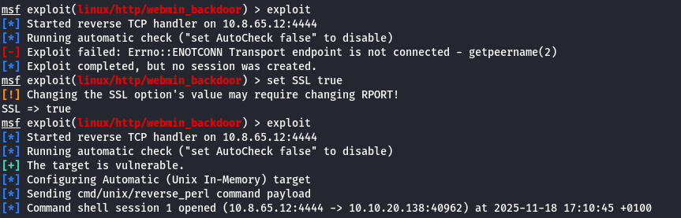
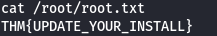
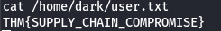

# Source
## Zadanie

Enumerate and root the box attached to this task. Can you discover the source of the disruption and leverage it to take control?

## Kroki

Standardowo zaczynamy od nmapa.

Jak zazwyczaj SSH jest otwarte oraz mamy dodatkowo WebMin operujący na porcie 10000.

Użyjmy metasploitable aby znaleźć podatności dla tej aplikacji.

Wykorzystamy podatność z indeksem 11.

Ustawiamy parametry i używamy `exploit`.

Okazuje się że jesteśmy rootem więc od razu zgarniamy obie flagi ;)

## Flaga

User: **THM{SUPPLY_CHAIN_COMPROMISE}**
Root: **THM{UPDATE_YOUR_INSTALL}**