# Tech_Supp0rt: 1
## Zadanie

Hack into the scammer's under-development website to foil their plans.

Hack into the machine and investigate the target.

Please allow about 5 minutes for the machine to fully boot!

Note: The theme and security warnings encountered in this room are part of the challenge.

## Kroki

W tym przypadku do znalezienia jest tylko flaga roota więc ciekawie. Uruchamiamy nmapa, burpa i rozglądamy się po naszym targecie.

Zaczynamy od skanu `nmap -sV -Pn -p- -T4 -sC`:

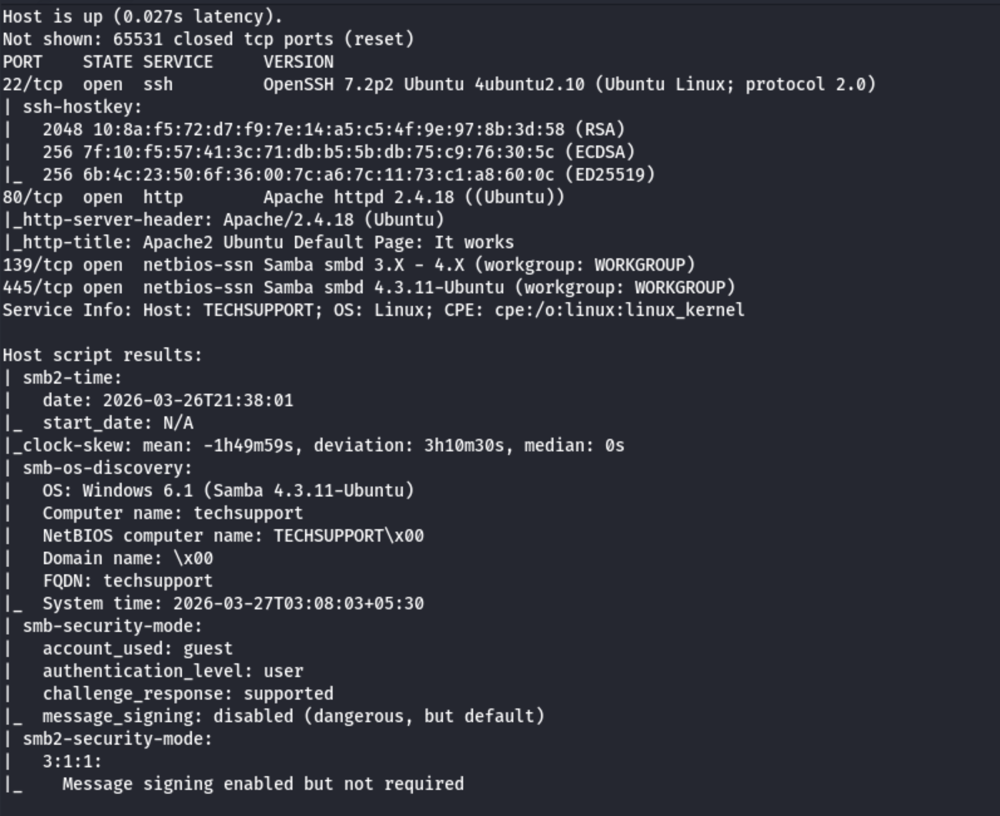

Mamy dostępne SSH, HTTP i SMB, zacznijmy w pierwszej kolejności od enumeracji HTTP, puściłem GoBustera 

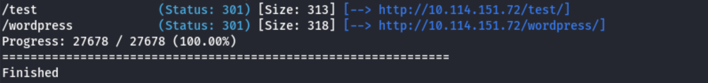

Zostały znalezione dwie ścieżki /test oraz /wordpress

Ścieżka /test zasypuje nas reklamami, a na stronie /wordpress znajduje się strona postawiona na wordpressie

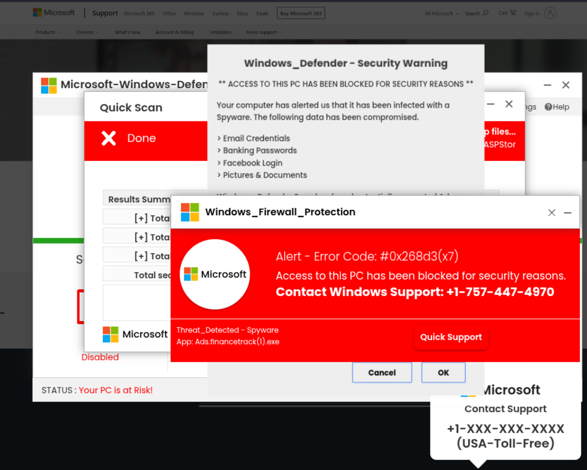

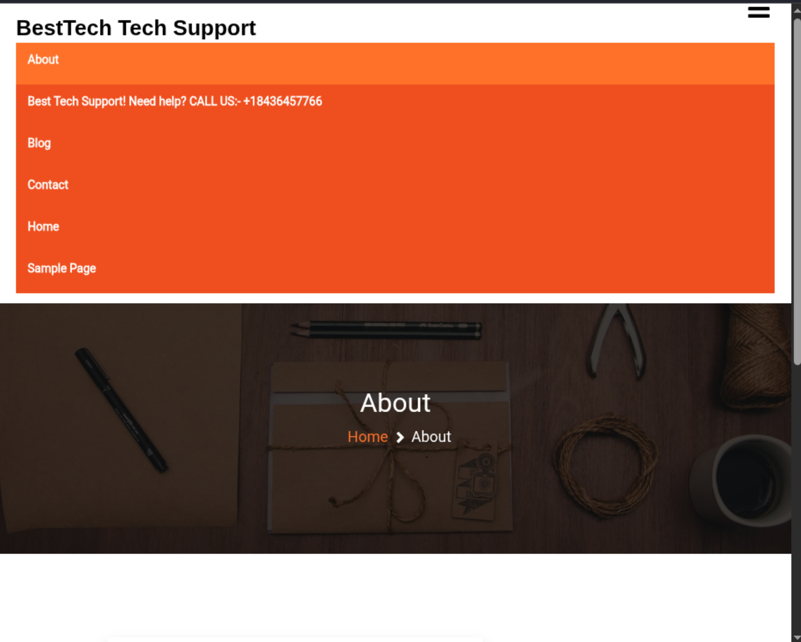

W międzyczasie przyjrzałem się protokołowi SMB, guest login był dozwolony więc sprawdziłem jakie pliki się tam kryją. Najpierw oczywiście wylistowałem udziały `smbclient -L //10.114.151.72/ -N`, a następnie wszedłem do jednego z nich:

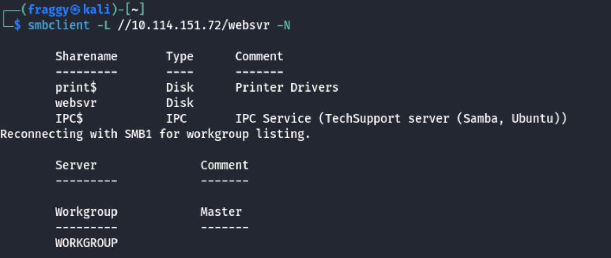

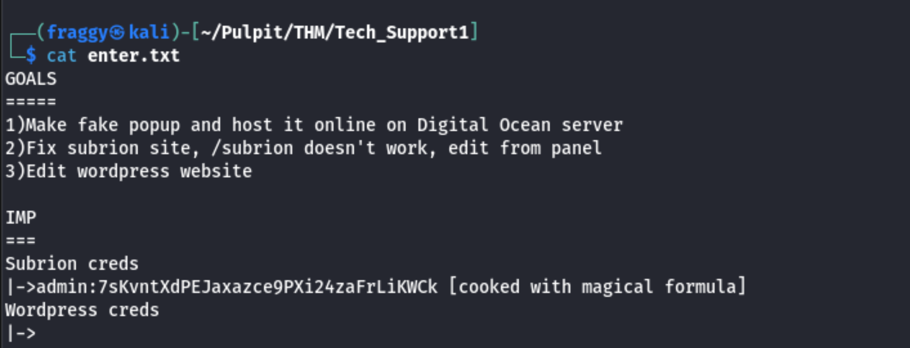

Był to dobry ruch, znaleźliśmy pare informacji takich jak ścieżka /subrion oraz dane z **chyba** zaszyfrowanym hasłem. Okazało się że był to Base64 po odkodowaniu dało to hasło *Scam2021*.

Po przejściu na /subrion przenosi nas do innej siec na adres 10.0.2.15, po krótkim researchu znalazłem repozytorium subriona na githubie, które zawiera plik robots.txt z ciekawymi ścieżkami.

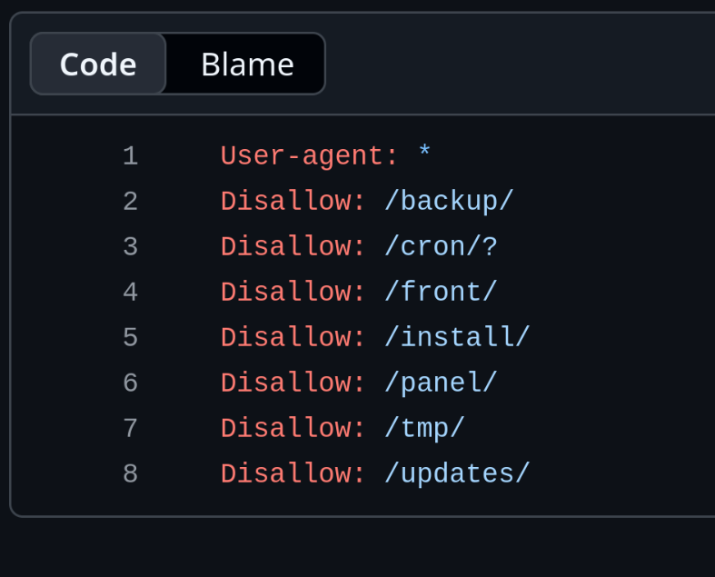

wchodzimy więc na /panel/ i tam logujemy się już znalezionymi credsami. 

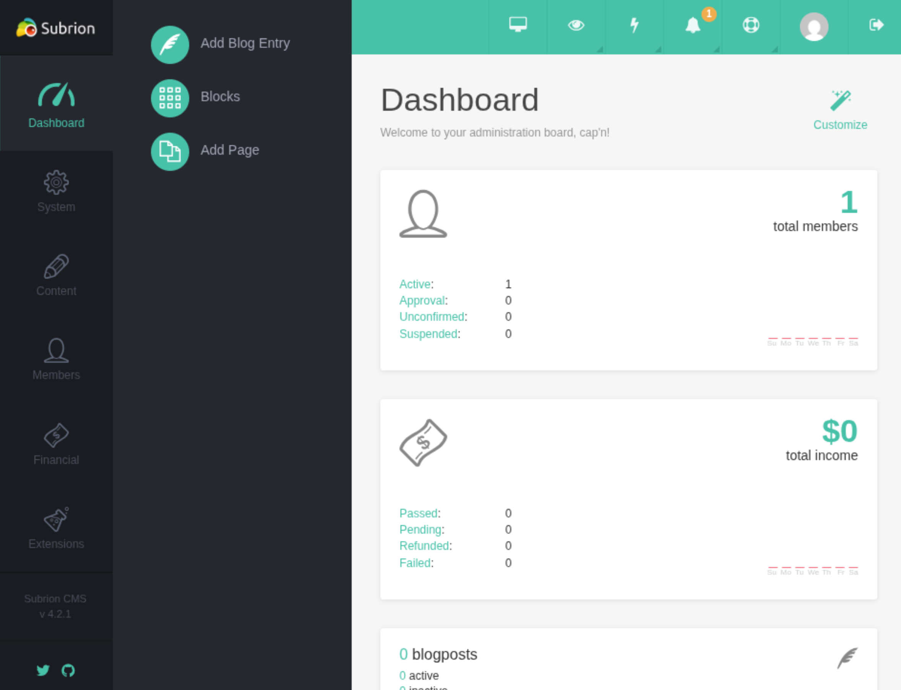

Jesteśmy na panelu admina, stąd znajdujemy wersję 4.2.1 i szukamy podatności dla niej. Wersja 4.2.1 jest podatna na Arbitrary File Upload, wykorzystamy to do zdalnego uzyskania dostępu do shella.

Wykorzystany exploit: https://www.exploit-db.com/exploits/49876

Możemy wykonywać komendy:

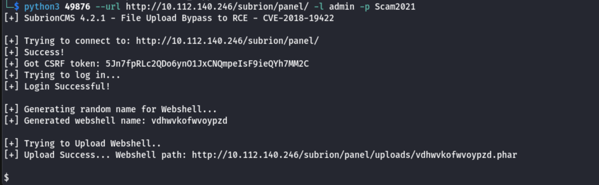

Od razu spawnujemy sobie shella pythonem i odbieramy go używając `nc -lvnp 9003`.

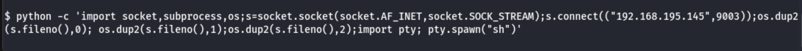

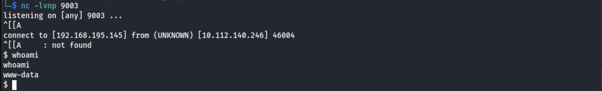

Odczytałen plik `/var/www/html/wordpress/wp-config.php` znalazłem tam hasło i username bazy danych.

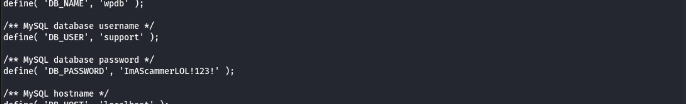

Okazało się że to hasło użytkownika scamsite, więc podłączyłem się jako scamsite przez ssh. 

`ssh scamsite@10.112.140.246`

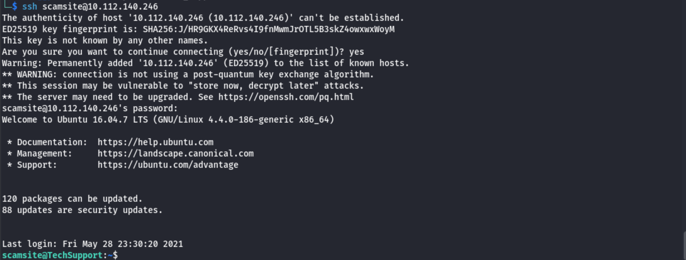

Po wpisaniu sudo -l krył się bardzo prosty sposób na odczyt dowolnego pliku o tym więcej na GTFObins.org

https://gtfobins.org/gtfobins/iconv/

Dzięki temu od razu odczytałem flagę z /root/root.txt

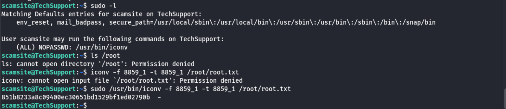

Przy okazji odblokowałem badge za 180 dni streaka :)

## Flaga

Flaga: **851b8233a8c09400ec30651bd1529bf1ed02790b**
